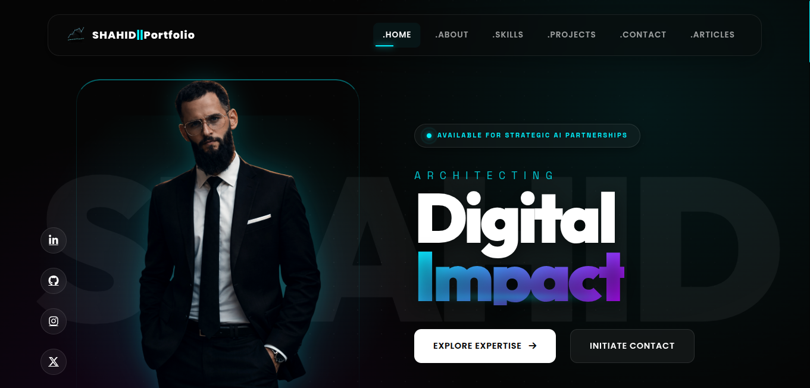
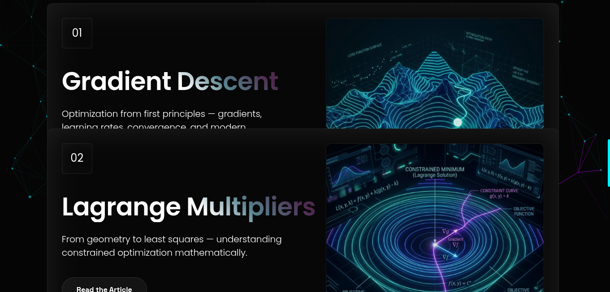
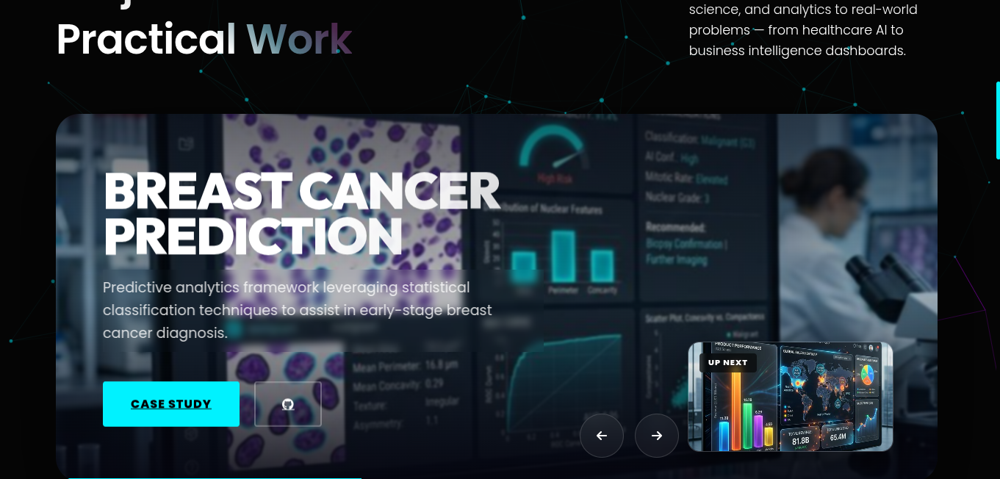
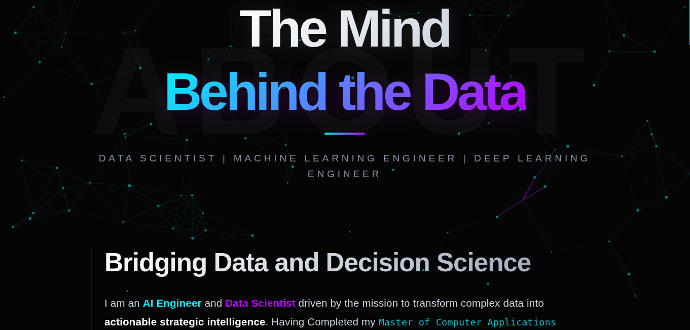
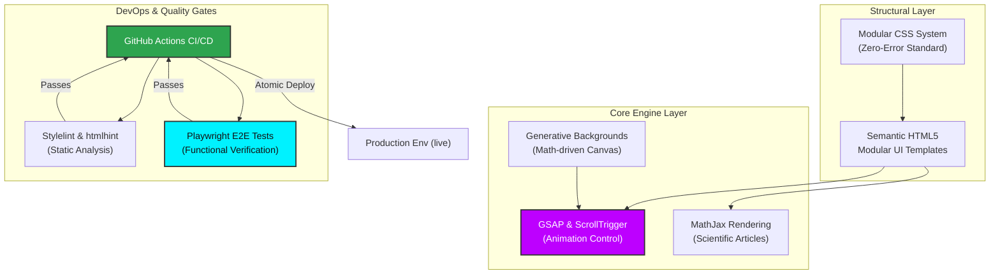

<div align="center">
  
  <h1>Shahid Ul Islam: AI & Data Science Portfolio</h1>
  <p><b>Machine Learning Engineer | Data Scientist | Research Focused</b></p>
  
  [](https://khanz9664.github.io/portfolio)
  [](https://www.linkedin.com/in/shahid-ul-islam-13650998)
  [](https://github.com/Khanz9664)
  
  [](https://github.com/Khanz9664/portfolio/actions/workflows/deploy.yml)
  [](https://github.com/Khanz9664/portfolio/actions/workflows/lint.yml)
  [](https://github.com/Khanz9664/portfolio/actions/workflows/test.yml)

  <br />

  <p align="center">
    <i>"Architecting resilient AI systems by bridging mathematical theory with production-grade engineering."</i>
  </p>
</div>

---

##  Visual Showcase

Experience the high-fidelity design system built with custom modular CSS and cinematic GSAP animations.

<p align="center">
  
  
</p>
<p align="center">
  
  
</p>

---

##  Technical Architecture

The portfolio is architected as a modular, high-performance static environment, prioritizing cinematic visuals without compromising on core DevOps stability.



---

##  Automated CI/CD Pipeline

Every commitment to the production environment undergoes a rigorous evaluation through our automated quality gates.

```mermaid
sequenceDiagram
    participant Dev as Developer
    participant GHA as GitHub Actions CI
    participant QG as Quality Gates (Lint/Test)
    participant Prod as GitHub Pages

    Dev->>GHA: Git Push (Main)
    activate GHA
    
    par Quality Audit
        GHA->>QG: Execute htmlhint & stylelint
        GHA->>QG: Execute Playwright E2E Suite
    end
    
    QG-->>GHA: Success Report
    
    rect rgb(20, 40, 20)
    Note right of GHA: Deployment Gate
    GHA->>Prod: Trigger Atomic Deployment
    Prod->>Prod: Build & Sync
    Prod->>Dev: Deployment Live
    end
    deactivate GHA
```



---

##  Automated Testing Methodology

To guarantee a premium user experience across all devices, we employ a **Playwright-driven** testing suite.

- **E2E Navigation**: Verifies navbar integrity, mobile menu toggles, and active link states across **Desktop Chrome**, **Firefox**, and **Mobile Safari**.
- **Functional Integrity**: Comprehensive testing of the "Arooth" contact form, including service chip selection and mocked API submissions.
- **Robust Error Handling**: Verified server-side failure detection to ensure graceful feedback to users.
- **Cross-Device Reliability**: Automated testing of the fluid typography and modular grid stacking at key breakpoints (`375px`, `768px`, `1024px`).

---

##  Scientific Methodology: ML Articles

A core pillar of this portfolio is the **"Machine Learning From First Principles"** series. These are rigorous mathematical derivations rendered with `MathJax`.

- **LaTeX Accuracy**: Precise rendering of calculus and linear algebra primitives.
- **Interactive Methodology**: GSAP-driven diagrams to illustrate concepts like Gradient Descent trajectories and Lagrange optimization boundaries.
- **Standard Scientific Narrative**: *Intuition -> Mathematical Derivation -> Algorithmic Implementation*.

---

##  Repository & Tooling

| Category | Tools | Standard |
| :--- | :--- | :--- |
| **Animation** | GSAP 3.12+ | Cinematic / Scroll-synced |
| **Logic** | Vanilla JS (ES6+) | Modular / Modern |
| **Quality** | Playwright, Stylelint | Zero-Error Policy |
| **Hosting** | GitHub Pages | Atomic CI/CD |

### Local Setup
1. **Clone & Install:**
   ```bash
   git clone https://github.com/Khanz9664/portfolio.git
   npm install
   ```
2. **Execute Tests:**
   ```bash
   npm test          # Run headless suite
   npm run test:ui   # Open Playwright UI
   ```
3. **Static Analysis:**
   ```bash
   npx stylelint "**/*.css"
   ```

## Technical Articles

| Article | Description | Category |
| :--- | :--- | :--- |
| **[Gradient Descent](https://khanz9664.github.io/portfolio/articles/gradient-descent.html)** | The workhorse of machine learning optimization. Understand partial derivatives, learning rates, and convergence behavior from first principles. | Optimization |
| **[Lagrange Multipliers](https://khanz9664.github.io/portfolio/articles/lagrange-multipliers.html)** | Constrained optimization unlocked. A deep dive into the method of Lagrange multipliers, dual problems, and their geometric intuition. | Optimization |
| **[Bias Variance TradeOff](https://khanz9664.github.io/portfolio/articles/biasvariance.html)** | The fundamental trade-off between model simplicity and prediction accuracy. | Optimization |
| **[Linear Regression](https://khanz9664.github.io/portfolio/articles/linear-regression.html)** | The foundation of predictive modeling. Complete mathematical derivation of Ordinary Least Squares, normal equations, and assumptions. | Supervised Learning |
| **[Logistic Regression](https://khanz9664.github.io/portfolio/articles/logistic-regression.html)** | Moving from continuous to categorical. Explore sigmoid functions, maximum likelihood estimation, and cross-entropy loss gradients. | Classification |
| **[Neural Networks](https://khanz9664.github.io/portfolio/articles/neuralnets.html)** | The mathematical foundations of deep learning. Explore forward propagation, backpropagation derivations, and the universal approximation theorem. | Deep Learning |
| **[Principal Component Analysis](https://khanz9664.github.io/portfolio/articles/pca.html)** | From variance maximization to SVD equivalence. A definitive guide to understanding PCA's mathematical machinery from the ground up. | Dimensionality Reduction |
| **[Information Theory](https://khanz9664.github.io/portfolio/articles/infotheory.html)** | The mathematics of uncertainty and learning. Explore Shannon entropy, KL divergence, cross-entropy, and the maximum entropy principle. | Information Theory |
| **[Singular Value Decomposition](https://khanz9664.github.io/portfolio/articles/svd.html)** | The most powerful factorization in all of mathematics. Works on every matrix, reveals hidden geometry, and underlies PCA and compression. | Linear Algebra |

---
<p align="center">
  Engineering Design © 2025 Shahid Ul Islam. <br />
  Built with passion for Mathematical Rigor and Technical Excellence.
</p>
<p align="center">
  <a href="https://khanz9664.github.io/portfolio">
    
  </a>
  <a href="https://github.com/khanz9664">
    
  </a>
  <a href="https://www.linkedin.com/in/shahid-ul-islam-13650998/">
    
  </a>
  <a href="https://www.kaggle.com/shaddy9664">
    
  </a>
  <a href="mailto:[EMAIL_ADDRESS]">
    
  </a>
</p>
