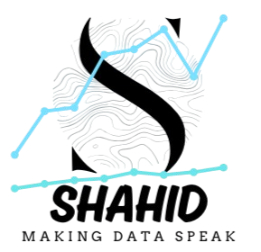
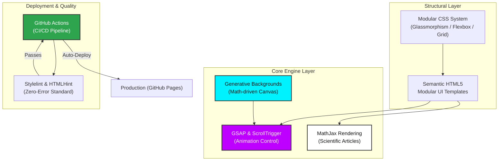

<div align="center">
  
  <h1>Shahid Ul Islam: AI & Data Science Portfolio</h1>
  <p><b>Machine Learning Engineer | Data Scientist | Research Focused</b></p>
  
  [](https://khanz9664.github.io/portfolio)
  [](https://www.linkedin.com/in/shahid-ul-islam-13650998)
  [](https://github.com/Khanz9664)
  
  [](https://github.com/Khanz9664/portfolio/actions/workflows/deploy.yml)
  [](https://github.com/Khanz9664/portfolio/actions/workflows/lint.yml)

  <br />

  <p align="center">
    <i>"Architecting resilient AI systems by bridging mathematical theory with production-grade engineering."</i>
  </p>
</div>

---

##  Overview

This repository hosts a high-fidelity, research-oriented portfolio showcasing advanced applications in **Artificial Intelligence**, **Deep Learning**, and **Mathematical Optimization**. Built with a "Machine Learning First Principles" philosophy, it serves as both a professional trajectory and a technical repository for rigorous ML articles.

> [!IMPORTANT]
> This environment is maintained under strict engineering standards, featuring **100% clean linting** for both HTML and CSS, and automated CI/CD for continuous deployment.

---

##  Technical Architecture

The portfolio is architected as a modular, high-performance static environment, prioritizing cinematic visuals without compromising on core performance metrics.



---

##  Automated CI/CD Pipeline

We employ a robust DevOps strategy using **GitHub Actions** to ensure that every commitment to the production environment meets high-level code quality standards.

### Workflow Logic:

```mermaid
sequenceDiagram
    participant Developer
    participant GitHub as GitHub Actions
    participant Linter as Static Analysis
    participant Deployment as Production Env

    Developer->>GitHub: Git Push (Main Branch)
    activate GitHub
    GitHub->>Linter: Execute HTMLHint (Standard Rules)
    GitHub->>Linter: Execute Stylelint (standard-config)
    Linter-->>GitHub: Quality Report (Pass/Fail)
    
    rect rgb(20, 40, 20)
    Note right of GitHub: If Linting Passes
    GitHub->>Deployment: Trigger Deployment Workflow
    Deployment->>Deployment: Build Static Assets
    Deployment->>Production Env: Atomic Deployment (live)
    end
    deactivate GitHub
```



- **Clean Code Guarantee:** Automated `htmlhint` and `stylelint` prevent broken tags or inconsistent styling from reaching production.
- **Zero-Latency Deployment:** Direct integration with GitHub Pages ensures the site is updated within seconds of a successful push.

---

##  Scientific Methodology: ML Articles

A core pillar of this portfolio is the **"Machine Learning From First Principles"** series. These articles are not just summaries; they are rigorous mathematical derivations.

- **LaTeX Rendering:** Uses `MathJax` for precision rendering of calculus and linear algebra.
- **Interactive Visuals:** GSAP-driven diagrams to illustrate concepts like Gradient Descent trajectories and Lagrange optimization boundaries.
- **Rigorous Structure:** Every article follows a standard scientific narrative: *Intuition -> Mathematical Derivation -> Algorithmic Implementation*.

---

##  Design System Tokens

The project utilizes a custom **High-Tech Aesthetic** design system built entirely from scratch (No Frameworks).

| Category | Implementation | Description |
| :--- | :--- | :--- |
| **Glassmorphism** | `backdrop-filter: blur(15px)` | Subtle, translucent overlays with glowing borders. |
| **Typography** | `Outfit`, `Space Grotesk` | High-readability technical pair using variable weights. |
| **Color Space** | `#00f2ff` (Cyan), `#bd00ff` (Violet) | Vibrant gradients against a `#050505` (Core Black) depth. |
| **Animation** | `GSAP`, `ScrollTrigger` | Cinematic, scroll-synced transitions for a premium feel. |

---

##  Repository Structure

```text
/
├── .github/workflows/   # CI/CD definition files (lint.yml, deploy.yml)
├── articles/            # Scientific ML derivations (HTML/MathJax)
├── css/                 # 12 Modular stylesheets (articles.css, hero.css, etc.)
├── js/                  # Interaction logic & Generative Backgrounds
├── img/                 # High-resolution optimized technical assets
├── index.html           # Command Center
└── ...                  # Modular Page Templates (about, skills, articles, contact)
```

---

##  Local Setup

To replicate the development environment:

1. **Clone & Install:**
   ```bash
   git clone https://github.com/Khanz9664/portfolio.git
   npm install
   ```

2. **Linting Commands:**
   ```bash
   npx htmlhint "**/*.html"
   npx stylelint "**/*.css"
   ```

3. **Live Environment:**
   Launch using **VS Code Live Server** for optimal hot-reloading.

---

##  Connectivity

I am actively seeking technical partnerships and research collaborations.

<div align="center">
  <a href="mailto:shahid9664@gmail.com"><b>Direct Email</b></a> • 
  <a href="https://linkedin.com/in/shahid-ul-islam-13650998"><b>LinkedIn</b></a> • 
  <a href="https://github.com/Khanz9664"><b>GitHub Lab</b></a>
</div>

---
<p align="center">
  Engineering Design © 2025 Shahid Ul Islam.
</p>
