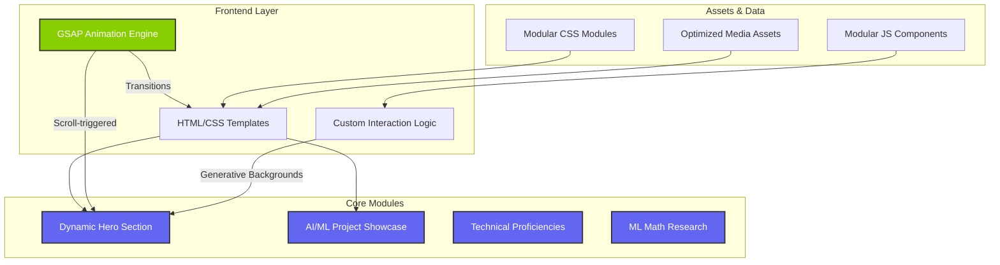
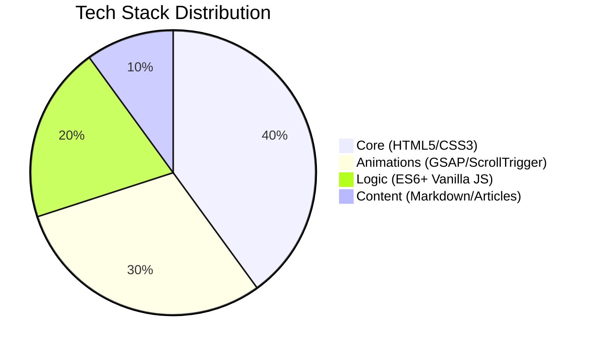

<div align="center">
  
  <h1>Shahid Ul Islam</h1>
  <p><b>Data Scientist | AI Engineer | Tech Enthusiast</b></p>
  
  [](https://khanz9664.github.io/portfolio)
  [](https://www.linkedin.com/in/shahid-ul-islam-13650998)
  [](https://github.com/Khanz9664)
  
  [](https://github.com/Khanz9664/portfolio/actions/workflows/deploy.yml)
  [](https://github.com/Khanz9664/portfolio/actions/workflows/lint.yml)

  <br />

  <p align="center">
    <i>"Bridging the gap between raw data and actionable intelligence through state-of-the-art AI systems."</i>
  </p>
</div>

---

##  Overview

Welcome to my personal portfolio repository—a high-performance, responsive showcase of my technical journey in **Artificial Intelligence** and **Data Science**. This project is not just a website; it's a demonstration of modern web engineering applied to professional identity, featuring state-of-the-art animations and a modular architecture.

> [!NOTE]
> This portfolio is built with a focus on performant animations and responsive design, ensuring a seamless experience across all devices.

---

##  Technical Architecture

The following diagram illustrates the relationship between the core components, modules, and content layers of the portfolio.



---

##  Technology Stack Heatmap

A deep dive into the technologies that power this experience, categorized by domain.



###  Performance & Interactivity
- **GSAP & ScrollTrigger**: State-of-the-art animation library for fluid, high-frame-rate interaction.
- **Generative Backgrounds**: Math-driven canvases that create a unique aesthetic on every visit.
- **Modular Stylesheets**: 12 custom CSS modules for high maintainability and specific component targeting.

---

##  Key Features

- **Responsive Design**: Mobile-first architecture that scales seamlessly to 4K displays.
- **Micro-interactions**: Subtle JS events that enhance user engagement and provide tactile feedback.
- **SEO Optimized**: Semantic HTML and meta-tagging for maximum search visibility.
- **Mathematical Insights**: A dedicated section for deep-dives into ML mathematics, including Gradient Descent and Neural Networks.

> [!TIP]
> Check out the `articles/` directory to see how technical ML concepts are documented and integrated into the site.

---

##  Project Structure

```text
portfolio/
├── .github/             # GitHub Actions Workflows (CI/CD)
├── articles/            # Scientific articles on ML Optimization & Algorithms
├── projects/            # Project Case-Studies
├── css/                 # 12 Modular stylesheets (Base, Hero, Navigation, etc.)
├── img/                 # High-resolution optimized assets & thumbnails
├── js/                  # Interaction logic & generative canvas scripts
├── index.html           # Command Center (Landing Page)
├── about.html           # Professional trajectory & mission
├── skills.html          # Technical matrix & proficiencies
├── projects.html        # AI/ML Deployment showcase
├── articles.html        # Academic-style research repository
└── contact.html         # Lead generation & social networking
```

---

##  Local Development

To explore the architecture or run the site locally:

1. **Clone the repository:**
   ```bash
   git clone https://github.com/Khanz9664/portfolio.git
   ```

2. **Launch with Live Server:**
   I recommend using the **Live Server** extension in VS Code for real-time hot-reloading.

> [!IMPORTANT]
> The generative backgrounds and GSAP animations are optimized for Chromium-based browsers but remain fully compatible across Safari and Firefox.

---

##  CI/CD & DevOps

This project leverages **GitHub Actions** to automate the development lifecycle:

- **Automated Deployment**: Every push to the `main` branch triggers a deployment to **GitHub Pages**, ensuring the live site is always up-to-date.
- **Code Quality (Linting)**: Automated workflows run `htmlhint` and `stylelint` on every push to maintain high standards for HTML and CSS.
- **Performance Auditing**: Built-in hooks for future performance and SEO auditing using Lighthouse CI.

---

##  Connect & Collaborate

I am always seeking opportunities to collaborate on innovative AI projects and data-driven solutions.

<div align="center">
  <a href="mailto:shahid9664@gmail.com"><b>Contact via Email</b></a> • 
  <a href="https://x.com/Shaddy9664"><b>Follow on X</b></a> • 
  <a href="https://www.instagram.com/shaddy9664"><b>Instagram</b></a>
</div>

---
<p align="center">© 2024 Shahid Ul Islam. All rights reserved.</p>
